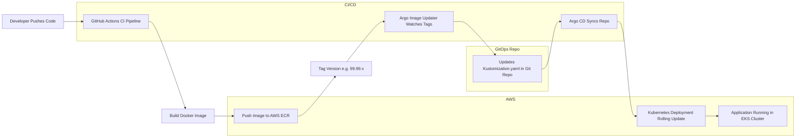

# Secure AWS EKS CI/CD Pipeline with Terraform, GitHub Actions, ArgoCD & GitOps

This project demonstrates a **secure, production-ready CI/CD + GitOps pipeline** for deploying containerized applications into **Amazon EKS** using:

- **Terraform** — Infrastructure as Code provision EKS, IAM, ECR, ALB Controller, Pod Identity
- **GitHub Actions** — CI pipeline and uses (OIDC) secure AWS authentication  
- **Amazon ECR** — container registry  
- **Amazon EKS** — managed Kubernetes  
- **Docker** — build images
- **ArgoCD** — GitOps continuous delivery  
- **ArgoCD Image Updater** — automated image version tracking and auto-updates DEV images
- **Kustomize overlays** — environment-specific configuration

The pipeline automatically:

1. Builds & tags Docker images  
2. Pushes images to ECR  
3. Updates Kubernetes manifests via GitOps  
4. Auto-syncs deployments to EKS  
5. Tracks image versions securely & automatically  

This project reflects **real-world DevOps engineering, security, automation, platform reliability, and cloud cost-efficiency.**

---

##  Repositories

| Repository | Description |
|---|---|
| https://github.com/mr-lington/Build-a-Secure-AWS-EKS-CI-CD-Pipeline-with-ArgoCD-GitHub-Actions | Terraform — AWS Infrastructure |
| https://github.com/mr-lington/Argocd-GitOps | GitOps — Kubernetes Manifests & Kustomize |
| https://github.com/mr-lington/lington-puffy-github-actions | App Repo — Docker Build + GitHub Actions |

---

##  Architecture

### Application Delivery Flow (GitOps CI/CD Pipeline)

Developer Push Code —> GitHub Actions(Build + Test + Docker Build + Push Image) —> Amazon ECR —> Argo CD Image Updater  (DEV only) (Detect new tags → update kustomization.yaml → commit to Git) —> Git Repo(GitOps — source of truth) —> Argo CD(Continuously syncs → deploys to EKS) —> AWS EKS(Kubernetes Cluster running app)

## Environments

| Environment | Purpose            | Sync           | Image Update              |
|-------------|--------------------|----------------|---------------------------|
| **Dev**     | Active development | Auto           | Auto (Argo Image Updater) |
| **Staging** | Release validation | Manual Promote | Tag-based                 |
| **Prod**    | Customer-facing    | Manual Promote | Tag-based                 |

This multi-environment setup mirrors real-world production governance, enabling rapid iteration in development while enforcing controlled, auditable promotions to higher environments.

## Cost-Saving Design Decisions

This project is built with cost optimisation in mind

**1. Managed EKS Node Scaling**  
Nodes are right-sized & only run required workloads.

**2. Private Workers — No Public IPs**  
Reduced NAT traffic & attack surface.

**3. Pod Identity — No Access Keys**  
AWS IAM Pod Identity replaces static IAM keys = zero credential leaks.

**4. GitOps — No CI Tools Running 24/7**  
ArgoCD pulls — we don’t keep expensive CI servers online like No Jenkins server, No EC2 build hosts, or No self-hosted runners. You only pay per-GitHub-Action minute & AWS usage.

**5. Dev Auto-Deploy Only**  
Staging & prod do not churn constantly, reducing:  
- rollout CPU usage  
- downtime risk  
- debugging time

**6. Managed Services Over Self-Hosted**  
No extra VMs = less cost & less maintenance.

**7. OIDC Authentication — No Secrets Manager Needed**

No stored AWS credentials → reduces:
- Security risk
- Secrets storage cost

**8. ECR Lifecycle Policies**

Only last N images are kept — old images auto-deleted.

**9. On-Demand Testing Environments**

Dev/Staging can be safely destroyed and recreated via Terraform.

**Result:**  
You ship faster, safer, and cheaper applications

## Repository Structure
```
├── application-repo                  # App source + Docker build + CI pipeline
│   # https://github.com/mr-lington/lington-puffy-github-actions
│
├── gitops-repo                       # ArgoCD + Kustomize manifests
│   # https://github.com/mr-lington/Argocd-GitOps
│   ├── base                         # Common base manifests
│   └── overlays
│   |    ├── dev                       # Development environment overlays
│   |    ├── staging                   # Staging environment overlays
│   |    └── prod                      # Production environment overlays
│   |
|   └── argocd/
|    ├── app-dev.yaml                  # argocd application manifest
|    ├── app-staging.yaml
|    └── app-prod.yaml
|   
|
|
|
└── terraform-infra                   # VPC, EKS, IAM, OIDC, ALB, add-ons
```

- `base/` holds shared Kubernetes manifests
- `overlays/` apply environment-specific differences via Kustomize
- `argocd/` holds shared argocd application manifests

---

##  Security Highlights

This setup follows enterprise-grade security best practices:

**1. IAM Least-Privilege Roles**  
All AWS roles and policies are scoped to the minimum required permissions.

**2. AWS IAM Pod Identity — No Static Credentials**  
Workloads authenticate to AWS services using Pod Identity instead of long-lived access keys = zero credential leak risk.

**3. Private ECR Access**  
Container registry is private and accessible only from within the VPC.

**4. GitOps Source-of-Truth Enforcement**  
All changes must go through Git — prevents drift and unauthorised direct cluster modifications.

**4. Access Controlled via ArgoCD RBAC**  
Fine-grained role-based access control for who can view/sync applications.

**5. Secure Deployment History & Audit Logs**  
Full traceability via Git commit history and ArgoCD application event logs.

**6. GitHub Actions authenticates to AWS via** **IAM OIDC**, meaning:

- No long-lived AWS credentials
- No secrets stored in GitHub
- Authentication tied to:
  - Repo identity
  - Branch
  - Tag reference

Example trust conditions:

```
repo:<org>/<repo>:ref:refs/heads/main
repo:<org>/<repo>:ref:refs/tags/v*
```

This ensures only **trusted workflows can assume AWS roles.**

---

## Useful Operational Commands

### Kubernetes
```
kubectl get pods -A
kubectl logs <pod>
kubectl describe pod <pod>
kubectl get svc -n dev
kubectl get applications -n argocd
```

### Check Argo Image Updater Logs
```
kubectl logs -n argocd deploy/updater-argocd-image-updater -f
```

### Port-forward ArgoCD UI
```
kubectl port-forward svc/argocd-server -n argocd 8080:443
```

### Git — Empty Commit to Trigger CI
```
git commit --allow-empty -m "trigger pipeline"
git push
```

### Terraform state debugging
```
terraform state list
terraform state rm <resource>
```

## Provisioning the Infrastructure (Terraform)

### Authenticate via AWS SSO
```bash
cd terraform/state.config

aws sso login --profile lington
export AWS_PROFILE=lington
export AWS_SDK_LOAD_CONFIG=1
export AWS_REGION=eu-west-3
export AWS_DEFAULT_REGION=eu-west-3
```

### Create Terraform Backend
```bash
terraform init
terraform apply -auto-approve
```

### Create Networking + EKS + IAM
```bash
cd ../foundation
terraform init
terraform plan
terraform apply -auto-approve

cd ../envs/dev/vpc
terraform init
terraform plan
terraform apply -auto-approve

cd ../eks
terraform init
terraform plan
terraform apply -auto-approve
```

### Connect kubectl to EKS
```bash
aws eks update-kubeconfig --region eu-west-3 --name dev-main --profile lington
```

### Deploy ArgoCD & Application

```bash
kubectl apply -f argocd/app-dev.yaml
```

### Retrieve Initial ArgoCD Admin Password
```bash
kubectl -n argocd get secret argocd-initial-admin-secret -o jsonpath="{.data.password}" | base64 --decode
```
**Copy the output — this is the initial admin password.**

**Login credentials:**

- **Username:** `admin`  
- **Password:** *(the decoded value from above)*  

 **Security Note:** Change this password immediately after your first login!

**Login at:**
```
http://localhost:8080
```
### GitOps + Auto Image Sync

ArgoCD Image Updater automatically detects new image tags in ECR and updates your GitOps repository:

**File updated:** `kustomization.yaml` (in the dev overlay)

**Example of the change it commits:**
```yaml
images:
  - name: lington-puffy-app1
    newName: 468887949677.dkr.ecr.eu-west-3.amazonaws.com/lington-puffy-app1
    newTag: 99.99.123  # ← Automatically updated to latest successful build
```

## Troubleshooting Guide

This section documents real issues encountered and fixed


### Issue — Port-forward failed

```
Unable to listen on port 8080
```

**Root cause:** port already in use  
**Fix:**

```
netstat -ano | findstr :8080
taskkill /PID <ID> /F
```

---

### Issue — Argo Image Updater not detecting Application

Logs showed:

```
considering 0 annotated applications
```

**Fix:** ensure Application YAML includes

```
argocd-image-updater.argoproj.io/image-list:
```

---

### Issue — Could Not Commit to GitHub Repo

Error:

```
credentials not configured in Argo CD settings
```

**Fix — add repo via UI**

ArgoCD UI → Settings → Repositories →  
Add HTTPS repo + GitHub PAT.

---

### Issue — Helm Release Error

```
cannot re-use a name that is still in use
```

**Fix Options**

```
helm list -A
helm uninstall argocd -n argocd
terraform state rm helm_release.argocd
```

**Fix:** correct Spring Boot packaging.

---

### Issue — Namespace empty after sync

```
kubectl get pods -n staging
No resources found
```

**Fix:** wrong path in ArgoCD app spec  
Correct to:

```
path: overlays/staging
```

---

### Issue — CLI Not Installed

```
argocd login localhost:8080
command not found
```

**Fix:** install ArgoCD CLI.

---

### Issue — Image Updater Updated Image but Not YAML

Fixed by setting:

```
argocd-image-updater.argoproj.io/write-back-target: kustomization
```
## Destroy Everything Safely (FinOps)

To avoid unexpected AWS charges, tear down the infrastructure **in the correct dependency order**.

### 1. Destroy EKS Cluster (dev environment)
```bash
cd terraform/envs/dev/eks
terraform init
terraform destroy -auto-approve
```
### 2. cd ../vpc
```
terraform init
terraform destroy -auto-approve
```
### 3. Destroy Shared Foundation Resources (IAM, OIDC, etc.)
```
cd ../../foundation
terraform init
terraform destroy -auto-approve
```
### 4. (Optional) Manually Clean Versioned S3 Objects
If the S3 bucket had versioning enabled and deletion fails:
```
# List and delete all object versions
aws s3api list-object-versions --bucket lington-terraform-state \
  --query '{Objects: Versions[].{Key:Key,VersionId:VersionId}}' \
  --output json > versions.json

aws s3api list-object-versions --bucket lington-terraform-state \
  --query '{Objects: DeleteMarkers[].{Key:Key,VersionId:VersionId}}' \
  --output json > delete-markers.json

aws s3api delete-objects --bucket lington-terraform-state --delete file://versions.json
aws s3api delete-objects --bucket lington-terraform-state --delete file://delete-markers.json

# Finally delete the bucket
aws s3 rb s3://lington-terraform-state --force
```
### 4. Destroy Terraform Backend S3 bucket
```
cd ../../state.config
terraform init
terraform destroy -auto-approve
```



## Skills Demonstrated

This project demonstrates:

- AWS EKS provisioning via Terraform  
- Secure IAM OIDC authentication  
- Kubernetes operations  
- CI/CD pipeline engineering  
- GitOps methodology  
- Production troubleshooting  
- Cost-optimized design  
- DevOps documentation quality  

---

##  Author

**Darlington “Osarodion” Imade**  
DevOps & Cloud Engineer — Ireland  

---

## Feedback & Collaboration

If you found this project useful — feel free to ⭐ the repo.

I’m always open to collaboration and DevOps roles.